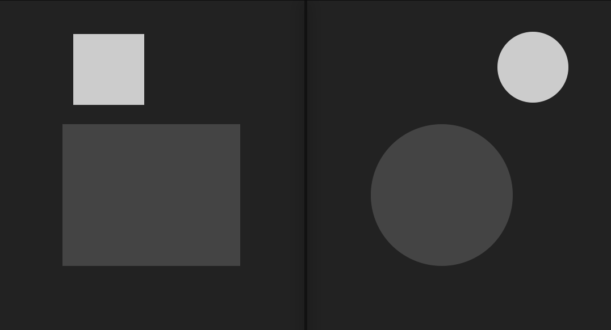

# Collisions

## Explications et objectif
Le petite version du carré et du rond sont déplacables. Pendant le déplacement, ils appellent leurs fonctions respectives afin de savoir s'ils sont en collision avec la forme du centre. Votre travail est de faire le code de ces fonctions de collision afin qu'elles retournent `true` ou `false` selon le cas.

## `test_collision_rectangles(rect1, rect2)`
Test la collision entre les deux rectangles. Doit retourner `true` ou `false` s'ils sont superposés.

- `rect1`
    - x
    - y
    - width
    - height
- `rect2`
    - x
    - y
    - width
    - height

## `test_collision_cercles(cercle1, cercle2)`
Test la collision entre les deux cercles. Doit retourner `true` ou `false` s'ils sont superposés.

Attention, le **x et y sont placé au centre du cercle**

- `cercle1`
    - x
    - y
    - radius
- `cercle2`
    - x
    - y
    - radius

